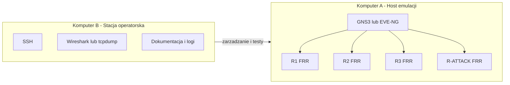
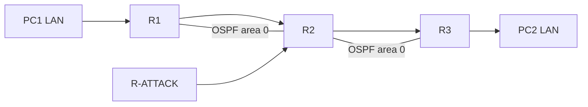
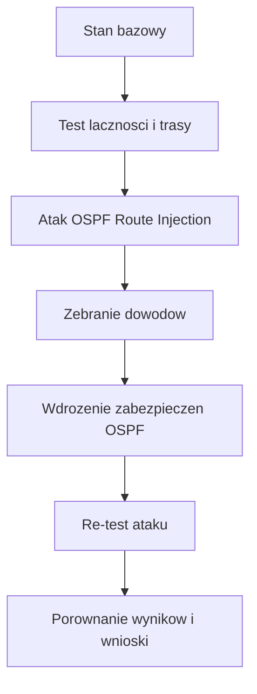
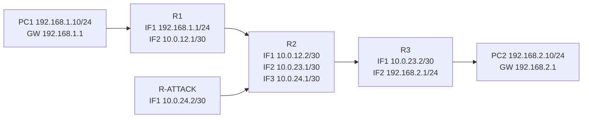
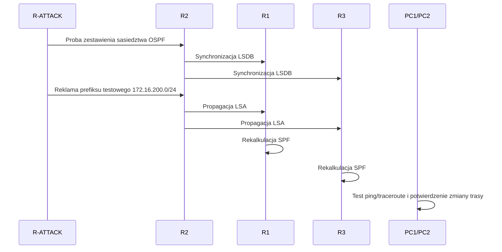

# Projekt zaliczeniowy

## 12. Atak na OSPF - Fałszowanie tras (OSPF Route Injection)

### Kierunek: Bezpieczeństwo sieci

### Autorzy
- Karol Ziobro
- Julia Jarząb

### Data
2026-03-28

---

## Spis treści

1. [Wstęp i cel projektu](#sec-1)
2. [Topologia i środowisko](#sec-2)
3. [Adresacja i role urządzeń](#sec-3)
4. [Scenariusz ataku: OSPF Route Injection](#sec-4)
5. [Wdrożone zabezpieczenia OSPF](#sec-5)
6. [Re-test po wdrożeniu zabezpieczeń](#sec-6)
7. [Dowody i wyniki testów](#sec-7)
8. [Wnioski i rekomendacje](#sec-8)
9. [Załączniki](#sec-9)

---

<a id="sec-1"></a>
## 1. Wstęp i cel projektu

Protokół OSPF (Open Shortest Path First) jest jednym z najczęściej stosowanych protokołów routingu wewnętrznego (IGP) w sieciach przedsiębiorstw. Działa dynamicznie, szybko reaguje na zmiany topologii i na podstawie metryk wybiera najkorzystniejsze trasy pomiędzy segmentami sieci. Z tego względu integralność informacji wymienianych pomiędzy sąsiadami OSPF ma kluczowe znaczenie dla stabilności i bezpieczeństwa całej infrastruktury.

W praktyce, jeżeli domena OSPF nie jest odpowiednio zabezpieczona, możliwe staje się dołączenie nieautoryzowanego urządzenia i wprowadzenie do procesu routingu fałszywych informacji o trasach. Taki scenariusz, określany jako **OSPF Route Injection**, może doprowadzić do nieprawidłowego przekierowania ruchu, utworzenia trasy typu blackhole, podsłuchu transmisji (man-in-the-middle) lub czasowej niedostępności usług. Skutki takiego ataku mogą objąć zarówno pojedynczy segment, jak i większą część sieci, zależnie od miejsca wstrzyknięcia oraz zaufania pomiędzy routerami.

Od strony technicznej OSPF jest protokołem typu link-state. Każdy router buduje lokalną bazę LSDB (Link-State Database), która reprezentuje wspólny obraz topologii w danym obszarze. Na podstawie tej bazy uruchamiany jest algorytm SPF (Dijkstry), który wyznacza najkrótsze ścieżki do wszystkich znanych prefiksów. Oznacza to, że pojedyncza, fałszywa informacja w LSDB może przełożyć się na zmianę decyzji routingu na wielu urządzeniach jednocześnie.

Wymiana informacji w OSPF odbywa się przez komunikaty LSA (Link-State Advertisement). W praktyce atakujący może próbować wpłynąć na trasowanie przez:
1. dołączenie nieautoryzowanego sąsiada OSPF i publikację własnych prefiksów,
2. redystrybucję sieci podłączonych tak, aby wyglądały na legalnie osiągalne,
3. manipulację metryką (kosztem), aby jego trasa została uznana za preferowaną,
4. generowanie nadmiarowych lub błędnych aktualizacji destabilizujących konwergencję.

Kluczowe znaczenie ma również sam proces budowania sąsiedztwa. Routery przechodzą przez stany: Down, Init, 2-Way, ExStart, Exchange, Loading i Full. Dopiero stan Full oznacza pełną synchronizację LSDB i realny wpływ sąsiada na obliczenia SPF. W sieciach wielodostępowych dodatkowo występuje wybór DR/BDR, co może zwiększać skutki błędnej konfiguracji, jeżeli nieautoryzowane urządzenie uzyska zbyt duży wpływ na wymianę informacji w segmencie.

W kontekście bezpieczeństwa szczególnie istotna jest różnica między poprawnym działaniem protokołu a modelem zaufania. OSPF z założenia zakłada współpracę zaufanych routerów w ramach jednej domeny administracyjnej. Jeżeli jednak granice zaufania nie są wymuszone konfiguracją (uwierzytelnianie, filtracja, segmentacja, kontrola dostępu do interfejsów routingu), protokół może zostać wykorzystany przeciwko samej infrastrukturze.

Warto podkreślić, że nie każda anomalia routingu oznacza skuteczny atak. Dlatego analiza musi obejmować porównanie kilku punktów obserwacji: tablic routingu, stanu sąsiedztwa OSPF, bazy LSDB oraz wyników testów łączności end-to-end. Dopiero zbieżność tych danych pozwala wiarygodnie potwierdzić, że zmiana ścieżek wynika z route injection, a nie np. z awarii łącza lub błędu adresacji.

Niniejszy projekt ma charakter praktyczny i laboratoryjny. Jego celem nie jest wyłącznie opis teoretyczny zagrożenia, ale przede wszystkim przeprowadzenie pełnego cyklu testowego: od poprawnie działającej sieci bazowej, przez kontrolowany atak, aż po wdrożenie zabezpieczenia i weryfikację jego skuteczności. Podejście to pozwala ocenić zarówno podatność środowiska, jak i realny efekt zastosowanych mechanizmów ochronnych.

Cele szczegółowe projektu:
1. Przygotowanie topologii testowej z wykorzystaniem routingu OSPF oraz zdefiniowanie ról urządzeń (routery legalne, hosty końcowe, węzeł atakujący).
2. Udokumentowanie stanu początkowego sieci, w tym poprawnej wymiany tras i osiągalności hostów.
3. Realizacja ataku Route Injection poprzez wprowadzenie fałszywej informacji routingu i obserwacja zmian w tablicach routingu.
4. Zebranie dowodów technicznych (komendy diagnostyczne, zrzuty konfiguracji, wyniki testów łączności) potwierdzających wpływ ataku.
5. Wdrożenie mechanizmu ochronnego w OSPF (uwierzytelnianie sąsiedztwa) oraz ponowne uruchomienie testu ataku.
6. Porównanie wyników przed i po zabezpieczeniu, wraz z oceną skuteczności i ograniczeń zastosowanej ochrony.

Zakres pracy obejmuje wyłącznie środowisko kontrolowane, przygotowane na potrzeby ćwiczenia akademickiego. Wszystkie działania są wykonywane w celu demonstracji ryzyk bezpieczeństwa i opracowania dobrych praktyk obronnych, a nie do zastosowań poza laboratorium.

Efektem końcowym projektu jest spójna dokumentacja techniczna zawierająca opis topologii, konfiguracji, przebiegu ataku, metod zabezpieczenia oraz wyników re-testu. Dokumentacja ta stanowi podstawę do sformułowania praktycznych wniosków i rekomendacji dotyczących ochrony protokołu OSPF przed fałszowaniem tras.

<a id="sec-2"></a>
## 2. Topologia i środowisko

W projekcie przyjęto wariant laboratoryjny oparty o emulację sieci w środowisku **GNS3/EVE-NG** oraz routery logiczne oparte na systemie Linux z pakietem **FRRouting (FRR)**. Celem takiego wyboru jest uzyskanie środowiska wystarczająco realistycznego dla protokołu OSPF, a jednocześnie lekkiego sprzętowo i łatwego do odtworzenia przez członków zespołu.

### 2.1. Uzasadnienie wyboru platformy

W porównaniu do uproszczonych symulatorów, GNS3/EVE-NG z FRR pozwala:
1. uruchomić rzeczywisty stos sieciowy Linux i realną implementację OSPF,
2. wykonywać diagnostykę na poziomie usług routingu (`vtysh`, `show ip ospf neighbor`, `show ip route`, `show ip ospf database`),
3. prowadzić analizę ruchu pakietowego narzędziami typu `tcpdump`/Wireshark,
4. łatwo odtwarzać scenariusze ataku i obrony w kontrolowanym środowisku.

To podejście zapewnia dobrą równowagę między realizmem technicznym a złożonością wdrożenia.

### 2.2. Organizacja środowiska na dwóch komputerach

Ze względu na dostępność dwóch stanowisk roboczych zastosowano podział ról:
1. **Komputer A (host emulacji)**: uruchomienie GNS3/EVE-NG, wszystkich węzłów topologii oraz połączeń między nimi.
2. **Komputer B (stacja operatorska/analityczna)**: dostęp administracyjny (SSH), wykonywanie testów łączności, przechwytywanie ruchu, dokumentowanie wyników.

Taki podział zmniejsza obciążenie pojedynczego hosta i poprawia jakość dowodów technicznych (stabilniejsze logi, mniej zakłóceń podczas przechwytywania ruchu).

Diagram organizacji pracy:



### 2.3. Model topologii logicznej

Topologia testowa została zaprojektowana jako liniowy rdzeń OSPF z dodatkowym węzłem atakującym:

`PC1 -> R1 -> R2 -> R3 -> PC2`

oraz dodatkowe połączenie:

`R-ATTACK -> R2`

Założenia funkcjonalne:
1. R1, R2 i R3 tworzą poprawną domenę OSPF i wymieniają trasy w trybie bazowym.
2. PC1 oraz PC2 reprezentują hosty końcowe wykorzystywane do testów osiągalności i kierunku ruchu.
3. R-ATTACK reprezentuje nieautoryzowane urządzenie próbujące wpłynąć na proces routingu przez route injection.

Diagram topologii logicznej:



### 2.4. Komponenty środowiska

W środowisku wykorzystano następujące klasy węzłów:
1. **Routery legalne (R1, R2, R3)**: Linux + FRR, obsługa OSPF w obszarze testowym.
2. **Router atakujący (R-ATTACK)**: Linux + FRR, konfiguracja wykorzystywana do publikacji fałszywych lub niepożądanych informacji routingu.
3. **Hosty testowe (PC1, PC2)**: endpointy do testów ping/traceroute i potwierdzania ścieżek ruchu.
4. **Narzędzia analityczne**: `tcpdump`, Wireshark, logi FRR, komendy diagnostyczne OSPF.

### 2.5. Wymagania sprzętowe i programowe

Minimalne wymagania dla wariantu projektu:
1. CPU: 4 rdzenie x86_64 z obsługą wirtualizacji sprzętowej (VT-x/AMD-V).
2. RAM: 8 GB.
3. Dysk: 40-60 GB wolnego miejsca (zalecany SSD).
4. System hosta: Linux/Windows/macOS.

Zalecane wymagania dla komfortowej pracy:
1. CPU: 6-8 rdzeni.
2. RAM: 16 GB.
3. Dysk: 100 GB SSD/NVMe.

Wymagane oprogramowanie:
1. GNS3 lub EVE-NG (zgodnie z preferencją zespołu).
2. Obrazy Linux dla routerów logicznych z zainstalowanym FRRouting.
3. Narzędzia diagnostyczne: Wireshark/tcpdump, klient SSH, podstawowe narzędzia sieciowe.

### 2.6. Założenia operacyjne laboratorium

Na potrzeby wiarygodności wyników przyjęto następujące założenia:
1. testy realizowane są wyłącznie w środowisku odseparowanym od sieci produkcyjnych,
2. czas systemowy na obu komputerach jest zsynchronizowany (spójność logów),
3. konfiguracja bazowa jest utrwalana przed każdym etapem (snapshot/backup),
4. porównanie wyników odbywa się w trzech stanach: przed atakiem, w trakcie ataku, po wdrożeniu zabezpieczeń,
5. sukces ataku lub obrony jest potwierdzany co najmniej dwoma źródłami dowodowymi (routing + test łączności lub routing + LSDB).

Diagram przebiegu eksperymentu:



### 2.7. Ograniczenia środowiska

Należy uwzględnić, że środowisko laboratoryjne, mimo wysokiej przydatności dydaktycznej, ma ograniczenia:
1. wydajność i opóźnienia zależą od zasobów hosta,
2. część zachowań może różnić się od urządzeń produkcyjnych klasy enterprise,
3. wyniki należy interpretować jako reprezentatywne dla badanego scenariusza, a nie jako pełny model każdej sieci produkcyjnej.

Mimo tych ograniczeń wybrana platforma jest adekwatna do realizacji celu projektu, ponieważ pozwala rzetelnie prześledzić mechanizm OSPF Route Injection oraz zweryfikować skuteczność zabezpieczenia opartego na uwierzytelnianiu OSPF.

### 2.8. Architektura FRRouting w laboratorium

Węzły routerowe oparte na FRRouting działają jako usługi użytkownika systemu Linux. Oznacza to, że warstwa przekazywania pakietów jest realizowana przez jądro systemu operacyjnego, natomiast logika protokołu OSPF przez procesy FRR. W praktyce umożliwia to bardzo precyzyjną diagnostykę: z jednej strony obserwujemy stan protokołu routingu, a z drugiej faktyczne wpisy tras w tablicy kernela.

W środowisku przyjęto podejście z rozdzieleniem odpowiedzialności:
1. Linux odpowiada za interfejsy, adresację IP i forwarding.
2. FRR odpowiada za wymianę informacji OSPF, utrzymanie LSDB oraz kalkulację SPF.
3. Narzędzia diagnostyczne weryfikują zgodność pomiędzy stanem OSPF i faktyczną ścieżką ruchu.

Taki model jest korzystny dydaktycznie, ponieważ pozwala łatwo wykazać zależność pomiędzy komunikatami OSPF a konsekwencjami w ruchu produkcyjnym. Jeśli pojawia się trasa błędna lub niepożądana, można prześledzić jej genezę od poziomu sąsiedztwa aż do efektu na hostach końcowych.

### 2.9. Plan uruchomienia i walidacji środowiska

Aby utrzymać powtarzalność, środowisko uruchamiane jest według stałej procedury:
1. Start platformy emulacyjnej (GNS3/EVE-NG) i wczytanie zapisanej topologii.
2. Uruchomienie routerów legalnych R1, R2, R3 oraz hostów końcowych PC1 i PC2.
3. Weryfikacja poprawności adresacji i routingu bazowego.
4. Dopiero po potwierdzeniu stanu bazowego uruchomienie węzła R-ATTACK.
5. Rejestracja wyników poleceń kontrolnych przed rozpoczęciem ataku.

Wstępna walidacja środowiska obejmuje:
1. sprawdzenie stanu interfejsów i adresacji na każdym routerze,
2. sprawdzenie sąsiedztwa OSPF pomiędzy R1-R2-R3,
3. sprawdzenie dostępności PC1 <-> PC2,
4. zapis tablic routingu jako punktu odniesienia dla kolejnych etapów.

Dzięki takiemu podejściu możliwe jest ograniczenie błędów metodycznych. Jeżeli w późniejszym etapie wystąpi anomalia, można jednoznacznie określić, czy wynika ona z działania ataku, czy z wcześniejszej niepoprawnej konfiguracji bazowej.

### 2.10. Kryteria jakości i powtarzalności wyników

W projekcie przyjęto, że każdy istotny efekt musi być potwierdzony wielokrotnie i z różnych perspektyw. Ogranicza to ryzyko wyciągania wniosków na podstawie pojedynczego, przypadkowego pomiaru.

Kryteria jakości pomiarów:
1. Każdy etap (przed atakiem, atak, po zabezpieczeniu) zawiera zestaw tych samych testów porównawczych.
2. Wnioski opierają się jednocześnie na danych z warstwy routingu oraz testach end-to-end.
3. Wyniki są rejestrowane w formie umożliwiającej odtworzenie (zrzuty, logi, komendy, timestampy).
4. Dla kluczowych obserwacji wykonywany jest test powtórny.

Kryteria uznania etapu za zakończony:
1. Stan bazowy: pełna osiągalność hostów i stabilne sąsiedztwa OSPF.
2. Etap ataku: potwierdzona zmiana decyzji routingu wynikająca z route injection.
3. Etap zabezpieczenia: brak możliwości skutecznego powtórzenia tej samej manipulacji trasami.

Dodatkowo założono dokumentowanie potencjalnych zakłóceń pomiaru, takich jak chwilowa rekonwergencja protokołu, opóźnienia po stronie hosta emulacji czy restart usług. Informacje te są niezbędne, aby odróżnić zachowanie wynikające z badanego scenariusza od artefaktów środowiskowych.

### 2.11. Scenariusze błędów środowiskowych i ich kontrola

W praktycznych laboratoriach sieciowych częstym problemem są błędy niezwiązane bezpośrednio z badanym atakiem. W celu ograniczenia takich sytuacji zdefiniowano podstawowe scenariusze kontrolne:
1. Brak sąsiedztwa OSPF z powodów konfiguracyjnych (niespójne area, maska, parametry interfejsu).
2. Niespójna adresacja między hostami i routerami.
3. Wyłączony forwarding IP na routerze Linux.
4. Błędna kolejność uruchamiania usług FRR.

Dla każdego z tych przypadków stosowana jest szybka checklista diagnostyczna, uruchamiana przed właściwą próbą ataku. Pozwala to skrócić czas debugowania i zwiększyć wiarygodność części eksperymentalnej raportu.

Przyjęcie opisanych procedur powoduje, że punkt 2 nie jest wyłącznie opisem statycznej topologii, ale pełnym opisem warunków badawczych, w których wyniki eksperymentu są technicznie uzasadnione i porównywalne.

<a id="sec-3"></a>
## 3. Adresacja i role urządzeń

W tej sekcji zdefiniowano szczegółowy plan adresacji IP, mapę interfejsów oraz role wszystkich urządzeń uczestniczących w laboratorium. Przyjęto adresację prywatną RFC1918 oraz logiczny podział na segmenty punkt-punkt i sieci LAN hostów końcowych.

### 3.1. Założenia adresacyjne

Projekt wykorzystuje trzy typy segmentów:
1. Łącza punkt-punkt pomiędzy routerami (podsiec /30).
2. Sieci dostępowe LAN dla hostów końcowych (podsiec /24).
3. Dodatkowy segment dla routera atakującego (podsiec /30).

Przyjęto następujące zasady:
1. Każde łącze router-router ma oddzielną podsieć /30.
2. Każdy host końcowy znajduje się w osobnej podsieci LAN.
3. Routery legalne pracują w jednej domenie OSPF (area 0).
4. Router atakujący jest fizycznie podłączony do R2 i logicznie przygotowany do prób route injection.

### 3.2. Tabela podsieci

| Segment | Adres sieci | Maska | Zakres hostów | Przeznaczenie |
|---|---|---|---|---|
| LAN-PC1 | 192.168.1.0 | /24 | 192.168.1.1-192.168.1.254 | Sieć hosta PC1 |
| R1-R2 | 10.0.12.0 | /30 | 10.0.12.1-10.0.12.2 | Łącze punkt-punkt R1-R2 |
| R2-R3 | 10.0.23.0 | /30 | 10.0.23.1-10.0.23.2 | Łącze punkt-punkt R2-R3 |
| R2-ATTACK | 10.0.24.0 | /30 | 10.0.24.1-10.0.24.2 | Łącze punkt-punkt R2-R-ATTACK |
| LAN-PC2 | 192.168.2.0 | /24 | 192.168.2.1-192.168.2.254 | Sieć hosta PC2 |
| TEST-INJECT | 172.16.200.0 | /24 | 172.16.200.1-172.16.200.254 | Prefiks testowy do demonstracji route injection |

### 3.3. Mapa interfejsów routerów

Nazwy interfejsów mogą się różnić zależnie od obrazu Linux (np. `ethX`, `ensX`). W dokumentacji stosowana jest nazwa logiczna IF1/IF2/IF3 dla czytelności.

| Urządzenie | Interfejs logiczny | Adres IP | Maska | Połączony z |
|---|---|---|---|---|
| R1 | IF1 (LAN) | 192.168.1.1 | /24 | PC1 |
| R1 | IF2 | 10.0.12.1 | /30 | R2 |
| R2 | IF1 | 10.0.12.2 | /30 | R1 |
| R2 | IF2 | 10.0.23.1 | /30 | R3 |
| R2 | IF3 | 10.0.24.1 | /30 | R-ATTACK |
| R3 | IF1 | 10.0.23.2 | /30 | R2 |
| R3 | IF2 (LAN) | 192.168.2.1 | /24 | PC2 |
| R-ATTACK | IF1 | 10.0.24.2 | /30 | R2 |

### 3.4. Konfiguracja hostów końcowych

| Host | Adres IP | Maska | Brama domyślna | Rola testowa |
|---|---|---|---|---|
| PC1 | 192.168.1.10 | /24 | 192.168.1.1 | Host źródłowy do testów ping/traceroute |
| PC2 | 192.168.2.10 | /24 | 192.168.2.1 | Host docelowy do testów osiągalności |

### 3.5. Role urządzeń w eksperymencie

| Urządzenie | Rola operacyjna | Funkcja w scenariuszu |
|---|---|---|
| R1 | Router brzegowy (strona źródłowa) | Dostarcza ruch z LAN-PC1 do domeny OSPF |
| R2 | Router centralny | Punkt tranzytowy i punkt styku z R-ATTACK |
| R3 | Router brzegowy (strona docelowa) | Dostarcza ruch do LAN-PC2 |
| R-ATTACK | Węzeł nieautoryzowany | Próby publikacji fałszywych tras/prefiksów |
| PC1 | Host testowy A | Generowanie ruchu testowego i pomiary przed/po ataku |
| PC2 | Host testowy B | Odbiór ruchu i potwierdzanie dostępności usług |

### 3.6. Parametry OSPF powiązane z adresacją

W stanie bazowym OSPF obejmuje legalne interfejsy R1-R2-R3. Dla przejrzystości i ograniczenia wpływu zmiennych zewnętrznych przyjęto:
1. Jeden obszar routingu: area 0.
2. Reklamację sieci tranzytowych oraz sieci LAN hostów końcowych.
3. Brak redystrybucji tras zewnętrznych w stanie bazowym.

Taki układ upraszcza analizę zmian i pozwala jednoznacznie wykazać wpływ route injection na tablice routingu.

### 3.7. Diagram adresacji (Mermaid)



### 3.8. Zakres danych do zebrania w etapie adresacji

Aby zapewnić spójność dalszych etapów raportu, po wdrożeniu adresacji należy zarchiwizować:
1. Stan interfejsów i adresów IP na wszystkich routerach.
2. Tablice routingu w stanie bazowym.
3. Potwierdzenie łączności PC1 -> PC2.
4. Potwierdzenie sąsiedztwa OSPF wyłącznie między routerami legalnymi.

Zebrane dane stanowią punkt odniesienia dla sekcji ataku, zabezpieczenia i re-testu.

<a id="sec-4"></a>
## 4. Scenariusz ataku: OSPF Route Injection

Sekcja opisuje kontrolowany scenariusz ataku laboratoryjnego, którego celem jest wykazanie, jak nieautoryzowany węzeł może wpłynąć na decyzje routingu OSPF przez wstrzyknięcie tras. Wszystkie działania wykonywane są wyłącznie w izolowanym środowisku testowym.

### 4.1. Cel etapu ataku

Celem scenariusza jest:
1. doprowadzenie do sytuacji, w której routery legalne zaakceptują informacje routingu pochodzące od R-ATTACK,
2. wywołanie mierzalnej zmiany w tablicach routingu,
3. potwierdzenie skutku ataku na poziomie testów end-to-end (ping/traceroute),
4. zebranie materiału dowodowego do porównania z etapem po wdrożeniu zabezpieczeń.

### 4.2. Warunki wejściowe (stan bazowy)

Przed rozpoczęciem ataku wymagane jest potwierdzenie, że środowisko działa poprawnie:
1. Sąsiedztwo OSPF pomiędzy R1-R2-R3 jest stabilne.
2. Trasa między LAN-PC1 i LAN-PC2 działa poprawnie.
3. W tablicach routingu nie występują prefiksy testowe od R-ATTACK.
4. R-ATTACK ma łączność warstwy 3 z interfejsem R2 na segmencie 10.0.24.0/30.

Minimalny zestaw poleceń kontrolnych (na routerach legalnych):

```bash
show ip ospf neighbor
show ip route
show ip ospf database
```

### 4.3. Założenie ataku

Wariant ataku zakłada, że R-ATTACK próbuje dołączyć do domeny OSPF i rozgłosić prefiks, który wpłynie na wybór ścieżki przez routery legalne. W laboratorium używany jest prefiks testowy `172.16.200.0/24`, aby jednoznacznie odróżnić wpływ ataku od tras produkcyjnych w topologii.

W zależności od konfiguracji bazowej, atak może mieć dwie formy:
1. Publikacja dodatkowej trasy zewnętrznej (route injection do LSDB).
2. Reklama prefiksu, który konkuruje metryką i zmienia preferowany next-hop.

### 4.4. Kroki wykonania ataku (lab)

#### Krok 1: Aktywacja OSPF na R-ATTACK
Na routerze R-ATTACK uruchamiany jest proces OSPF dla interfejsu łączącego z R2.

#### Krok 2: Przygotowanie prefiksu testowego
Tworzony jest lokalny prefiks testowy (np. interfejs loopback), który następnie może zostać rozgłoszony do OSPF.

#### Krok 3: Wstrzyknięcie trasy
R-ATTACK rozpoczyna reklamowanie prefiksu testowego do domeny OSPF zgodnie z przyjętą techniką laboratoryjną.

#### Krok 4: Obserwacja konwergencji
Na R1, R2 i R3 monitorowane są:
1. zmiany sąsiedztwa OSPF,
2. pojawienie się nowego prefiksu w tablicach routingu,
3. zmiany next-hop dla analizowanego ruchu.

#### Krok 5: Test ruchu hostów końcowych
Z PC1 wykonywane są testy do PC2 i do prefiksu testowego. Dodatkowo wykonywany jest traceroute w celu weryfikacji ścieżki.

### 4.5. Przykładowy szkielet konfiguracji na R-ATTACK (FRR)

Poniższy fragment przedstawia poglądowy szkielet konfiguracji wykorzystywany w laboratorium:

```bash
router ospf
 network 10.0.24.0/30 area 0

interface lo
 ip address 172.16.200.1/24

router ospf
 redistribute connected
```

Uwaga: finalna konfiguracja może różnić się nazwami interfejsów i składnią zależnie od użytego obrazu Linux/FRR.

### 4.6. Oczekiwane artefakty po ataku

Po wykonaniu scenariusza powinny zostać zebrane następujące dowody:
1. Zrzuty `show ip ospf neighbor` z momentu zestawienia relacji z R-ATTACK.
2. Zrzuty `show ip route` pokazujące pojawienie się prefiksu testowego.
3. Zrzuty `show ip ospf database` potwierdzające reklamę LSA.
4. Wyniki ping i traceroute przed oraz po ataku.
5. (Opcjonalnie) pcap z interfejsu R2-R-ATTACK potwierdzający wymianę pakietów OSPF.

### 4.7. Kryteria sukcesu ataku

Atak uznaje się za skuteczny, jeżeli jednocześnie spełnione są warunki:
1. Routery legalne akceptują informację OSPF pochodzącą od R-ATTACK.
2. W tablicach routingu pojawia się prefiks testowy lub zmienia się preferowana ścieżka.
3. Testy ruchu potwierdzają wpływ tej zmiany na rzeczywisty forwarding.

Jeżeli zmiana występuje tylko w pojedynczym źródle danych (np. sam log bez zmiany routingu), etap nie jest uznawany za pełny sukces i wymaga ponownej walidacji.

### 4.8. Kryteria niepowodzenia i diagnostyka

Najczęstsze przyczyny niepowodzenia ataku w laboratorium:
1. Brak pełnego sąsiedztwa OSPF (nieosiągnięty stan Full).
2. Błędna adresacja lub brak aktywnego interfejsu na R-ATTACK.
3. Brak rozgłaszania prefiksu testowego do procesu OSPF.
4. Nadpisanie trasy przez bardziej preferowaną metrykę istniejącą w topologii.

W takich przypadkach należy ponownie przejść checklistę z sekcji 2 i 3 oraz powtórzyć pomiary po przywróceniu stanu bazowego.

### 4.9. Diagram przebiegu ataku (Mermaid)



### 4.10. Wynik etapu

Wyniki tego etapu są punktem odniesienia dla sekcji 5 i 6. Celem kolejnych kroków będzie wdrożenie mechanizmu ochrony OSPF oraz wykazanie, że analogiczna próba route injection przestaje być skuteczna po zastosowaniu zabezpieczenia.

<a id="sec-5"></a>
## 5. Wdrożone zabezpieczenia OSPF

_Sekcja do uzupełnienia._

<a id="sec-6"></a>
## 6. Re-test po wdrożeniu zabezpieczeń

_Sekcja do uzupełnienia._

<a id="sec-7"></a>
## 7. Dowody i wyniki testów

_Sekcja do uzupełnienia._

<a id="sec-8"></a>
## 8. Wnioski i rekomendacje

_Sekcja do uzupełnienia._

<a id="sec-9"></a>
## 9. Załączniki

_Sekcja do uzupełnienia._
