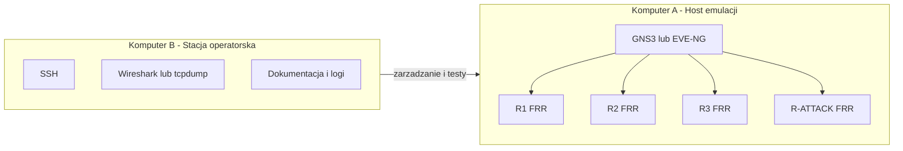
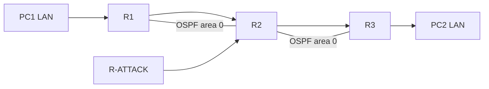
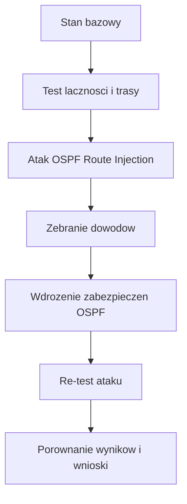

# Projekt zaliczeniowy

## 12. Atak na OSPF - Fałszowanie tras (OSPF Route Injection)

### Kierunek: Bezpieczeństwo sieci

### Autorzy
- Karol Ziobro
- Julia Jarząb

### Data
2026-03-28

---

## Spis treści

1. [Wstęp i cel projektu](#sec-1)
2. [Topologia i środowisko](#sec-2)
3. [Adresacja i role urządzeń](#sec-3)
4. [Scenariusz ataku: OSPF Route Injection](#sec-4)
5. [Wdrożone zabezpieczenia OSPF](#sec-5)
6. [Re-test po wdrożeniu zabezpieczeń](#sec-6)
7. [Dowody i wyniki testów](#sec-7)
8. [Wnioski i rekomendacje](#sec-8)
9. [Załączniki](#sec-9)

---

## 1. Wstęp i cel projektu

Protokół OSPF (Open Shortest Path First) jest jednym z najczęściej stosowanych protokołów routingu wewnętrznego (IGP) w sieciach przedsiębiorstw. Działa dynamicznie, szybko reaguje na zmiany topologii i na podstawie metryk wybiera najkorzystniejsze trasy pomiędzy segmentami sieci. Z tego względu integralność informacji wymienianych pomiędzy sąsiadami OSPF ma kluczowe znaczenie dla stabilności i bezpieczeństwa całej infrastruktury.

W praktyce, jeżeli domena OSPF nie jest odpowiednio zabezpieczona, możliwe staje się dołączenie nieautoryzowanego urządzenia i wprowadzenie do procesu routingu fałszywych informacji o trasach. Taki scenariusz, określany jako **OSPF Route Injection**, może doprowadzić do nieprawidłowego przekierowania ruchu, utworzenia trasy typu blackhole, podsłuchu transmisji (man-in-the-middle) lub czasowej niedostępności usług. Skutki takiego ataku mogą objąć zarówno pojedynczy segment, jak i większą część sieci, zależnie od miejsca wstrzyknięcia oraz zaufania pomiędzy routerami.

Od strony technicznej OSPF jest protokołem typu link-state. Każdy router buduje lokalną bazę LSDB (Link-State Database), która reprezentuje wspólny obraz topologii w danym obszarze. Na podstawie tej bazy uruchamiany jest algorytm SPF (Dijkstry), który wyznacza najkrótsze ścieżki do wszystkich znanych prefiksów. Oznacza to, że pojedyncza, fałszywa informacja w LSDB może przełożyć się na zmianę decyzji routingu na wielu urządzeniach jednocześnie.

Wymiana informacji w OSPF odbywa się przez komunikaty LSA (Link-State Advertisement). W praktyce atakujący może próbować wpłynąć na trasowanie przez:
1. dołączenie nieautoryzowanego sąsiada OSPF i publikację własnych prefiksów,
2. redystrybucję sieci podłączonych tak, aby wyglądały na legalnie osiągalne,
3. manipulację metryką (kosztem), aby jego trasa została uznana za preferowaną,
4. generowanie nadmiarowych lub błędnych aktualizacji destabilizujących konwergencję.

Kluczowe znaczenie ma również sam proces budowania sąsiedztwa. Routery przechodzą przez stany: Down, Init, 2-Way, ExStart, Exchange, Loading i Full. Dopiero stan Full oznacza pełną synchronizację LSDB i realny wpływ sąsiada na obliczenia SPF. W sieciach wielodostępowych dodatkowo występuje wybór DR/BDR, co może zwiększać skutki błędnej konfiguracji, jeżeli nieautoryzowane urządzenie uzyska zbyt duży wpływ na wymianę informacji w segmencie.

W kontekście bezpieczeństwa szczególnie istotna jest różnica między poprawnym działaniem protokołu a modelem zaufania. OSPF z założenia zakłada współpracę zaufanych routerów w ramach jednej domeny administracyjnej. Jeżeli jednak granice zaufania nie są wymuszone konfiguracją (uwierzytelnianie, filtracja, segmentacja, kontrola dostępu do interfejsów routingu), protokół może zostać wykorzystany przeciwko samej infrastrukturze.

Warto podkreślić, że nie każda anomalia routingu oznacza skuteczny atak. Dlatego analiza musi obejmować porównanie kilku punktów obserwacji: tablic routingu, stanu sąsiedztwa OSPF, bazy LSDB oraz wyników testów łączności end-to-end. Dopiero zbieżność tych danych pozwala wiarygodnie potwierdzić, że zmiana ścieżek wynika z route injection, a nie np. z awarii łącza lub błędu adresacji.

Niniejszy projekt ma charakter praktyczny i laboratoryjny. Jego celem nie jest wyłącznie opis teoretyczny zagrożenia, ale przede wszystkim przeprowadzenie pełnego cyklu testowego: od poprawnie działającej sieci bazowej, przez kontrolowany atak, aż po wdrożenie zabezpieczenia i weryfikację jego skuteczności. Podejście to pozwala ocenić zarówno podatność środowiska, jak i realny efekt zastosowanych mechanizmów ochronnych.

Cele szczegółowe projektu:
1. Przygotowanie topologii testowej z wykorzystaniem routingu OSPF oraz zdefiniowanie ról urządzeń (routery legalne, hosty końcowe, węzeł atakujący).
2. Udokumentowanie stanu początkowego sieci, w tym poprawnej wymiany tras i osiągalności hostów.
3. Realizacja ataku Route Injection poprzez wprowadzenie fałszywej informacji routingu i obserwacja zmian w tablicach routingu.
4. Zebranie dowodów technicznych (komendy diagnostyczne, zrzuty konfiguracji, wyniki testów łączności) potwierdzających wpływ ataku.
5. Wdrożenie mechanizmu ochronnego w OSPF (uwierzytelnianie sąsiedztwa) oraz ponowne uruchomienie testu ataku.
6. Porównanie wyników przed i po zabezpieczeniu, wraz z oceną skuteczności i ograniczeń zastosowanej ochrony.

Zakres pracy obejmuje wyłącznie środowisko kontrolowane, przygotowane na potrzeby ćwiczenia akademickiego. Wszystkie działania są wykonywane w celu demonstracji ryzyk bezpieczeństwa i opracowania dobrych praktyk obronnych, a nie do zastosowań poza laboratorium.

Efektem końcowym projektu jest spójna dokumentacja techniczna zawierająca opis topologii, konfiguracji, przebiegu ataku, metod zabezpieczenia oraz wyników re-testu. Dokumentacja ta stanowi podstawę do sformułowania praktycznych wniosków i rekomendacji dotyczących ochrony protokołu OSPF przed fałszowaniem tras.

## 2. Topologia i środowisko

W projekcie przyjęto wariant laboratoryjny oparty o emulację sieci w środowisku **GNS3/EVE-NG** oraz routery logiczne oparte na systemie Linux z pakietem **FRRouting (FRR)**. Celem takiego wyboru jest uzyskanie środowiska wystarczająco realistycznego dla protokołu OSPF, a jednocześnie lekkiego sprzętowo i łatwego do odtworzenia przez członków zespołu.

### 2.1. Uzasadnienie wyboru platformy

W porównaniu do uproszczonych symulatorów, GNS3/EVE-NG z FRR pozwala:
1. uruchomić rzeczywisty stos sieciowy Linux i realną implementację OSPF,
2. wykonywać diagnostykę na poziomie usług routingu (`vtysh`, `show ip ospf neighbor`, `show ip route`, `show ip ospf database`),
3. prowadzić analizę ruchu pakietowego narzędziami typu `tcpdump`/Wireshark,
4. łatwo odtwarzać scenariusze ataku i obrony w kontrolowanym środowisku.

To podejście zapewnia dobrą równowagę między realizmem technicznym a złożonością wdrożenia.

### 2.2. Organizacja środowiska na dwóch komputerach

Ze względu na dostępność dwóch stanowisk roboczych zastosowano podział ról:
1. **Komputer A (host emulacji)**: uruchomienie GNS3/EVE-NG, wszystkich węzłów topologii oraz połączeń między nimi.
2. **Komputer B (stacja operatorska/analityczna)**: dostęp administracyjny (SSH), wykonywanie testów łączności, przechwytywanie ruchu, dokumentowanie wyników.

Taki podział zmniejsza obciążenie pojedynczego hosta i poprawia jakość dowodów technicznych (stabilniejsze logi, mniej zakłóceń podczas przechwytywania ruchu).

Diagram organizacji pracy:

### 2.3. Model topologii logicznej

Topologia testowa została zaprojektowana jako liniowy rdzeń OSPF z dodatkowym węzłem atakującym:

`PC1 -> R1 -> R2 -> R3 -> PC2`

oraz dodatkowe połączenie:

`R-ATTACK -> R2`

Założenia funkcjonalne:
1. R1, R2 i R3 tworzą poprawną domenę OSPF i wymieniają trasy w trybie bazowym.
2. PC1 oraz PC2 reprezentują hosty końcowe wykorzystywane do testów osiągalności i kierunku ruchu.
3. R-ATTACK reprezentuje nieautoryzowane urządzenie próbujące wpłynąć na proces routingu przez route injection.

Diagram topologii logicznej:

### 2.4. Komponenty środowiska

W środowisku wykorzystano następujące klasy węzłów:
1. **Routery legalne (R1, R2, R3)**: Linux + FRR, obsługa OSPF w obszarze testowym.
2. **Router atakujący (R-ATTACK)**: Linux + FRR, konfiguracja wykorzystywana do publikacji fałszywych lub niepożądanych informacji routingu.
3. **Hosty testowe (PC1, PC2)**: endpointy do testów ping/traceroute i potwierdzania ścieżek ruchu.
4. **Narzędzia analityczne**: `tcpdump`, Wireshark, logi FRR, komendy diagnostyczne OSPF.

### 2.5. Wymagania sprzętowe i programowe

Minimalne wymagania dla wariantu projektu:
1. CPU: 4 rdzenie x86_64 z obsługą wirtualizacji sprzętowej (VT-x/AMD-V).
2. RAM: 8 GB.
3. Dysk: 40-60 GB wolnego miejsca (zalecany SSD).
4. System hosta: Linux/Windows/macOS.

Zalecane wymagania dla komfortowej pracy:
1. CPU: 6-8 rdzeni.
2. RAM: 16 GB.
3. Dysk: 100 GB SSD/NVMe.

Wymagane oprogramowanie:
1. GNS3 lub EVE-NG (zgodnie z preferencją zespołu).
2. Obrazy Linux dla routerów logicznych z zainstalowanym FRRouting.
3. Narzędzia diagnostyczne: Wireshark/tcpdump, klient SSH, podstawowe narzędzia sieciowe.

### 2.6. Założenia operacyjne laboratorium

Na potrzeby wiarygodności wyników przyjęto następujące założenia:
1. testy realizowane są wyłącznie w środowisku odseparowanym od sieci produkcyjnych,
2. czas systemowy na obu komputerach jest zsynchronizowany (spójność logów),
3. konfiguracja bazowa jest utrwalana przed każdym etapem (snapshot/backup),
4. porównanie wyników odbywa się w trzech stanach: przed atakiem, w trakcie ataku, po wdrożeniu zabezpieczeń,
5. sukces ataku lub obrony jest potwierdzany co najmniej dwoma źródłami dowodowymi (routing + test łączności lub routing + LSDB).

Diagram przebiegu eksperymentu:

### 2.7. Ograniczenia środowiska

Należy uwzględnić, że środowisko laboratoryjne, mimo wysokiej przydatności dydaktycznej, ma ograniczenia:
1. wydajność i opóźnienia zależą od zasobów hosta,
2. część zachowań może różnić się od urządzeń produkcyjnych klasy enterprise,
3. wyniki należy interpretować jako reprezentatywne dla badanego scenariusza, a nie jako pełny model każdej sieci produkcyjnej.

Mimo tych ograniczeń wybrana platforma jest adekwatna do realizacji celu projektu, ponieważ pozwala rzetelnie prześledzić mechanizm OSPF Route Injection oraz zweryfikować skuteczność zabezpieczenia opartego na uwierzytelnianiu OSPF.

## 3. Adresacja i role urządzeń

_Sekcja do uzupełnienia._

## 4. Scenariusz ataku: OSPF Route Injection

_Sekcja do uzupełnienia._

## 5. Wdrożone zabezpieczenia OSPF

_Sekcja do uzupełnienia._

## 6. Re-test po wdrożeniu zabezpieczeń

_Sekcja do uzupełnienia._

## 7. Dowody i wyniki testów

_Sekcja do uzupełnienia._

## 8. Wnioski i rekomendacje

_Sekcja do uzupełnienia._

## 9. Załączniki

_Sekcja do uzupełnienia._
