# Projekt zaliczeniowy

## 12. Atak na OSPF - Fałszowanie tras (OSPF Route Injection)

### Kierunek: Bezpieczeństwo sieci

### Autorzy
- Karol Ziobro
- Julia Jarząb

### Data
2026-03-28

---

## Spis treści

1. [Wstęp i cel projektu](#sec-1)
2. [Topologia i środowisko](#sec-2)
3. [Adresacja i role urządzeń](#sec-3)
4. [Scenariusz ataku: OSPF Route Injection](#sec-4)
5. [Wdrożone zabezpieczenia OSPF](#sec-5)
6. [Re-test po wdrożeniu zabezpieczeń](#sec-6)
7. [Dowody i wyniki testów](#sec-7)
8. [Wnioski i rekomendacje](#sec-8)
9. [Załączniki](#sec-9)

---

<a id="sec-1"></a>
## 1. Wstęp i cel projektu

Protokół OSPF (Open Shortest Path First) jest jednym z najczęściej stosowanych protokołów routingu wewnętrznego (IGP) w sieciach przedsiębiorstw. Działa dynamicznie, szybko reaguje na zmiany topologii i na podstawie metryk wybiera najkorzystniejsze trasy pomiędzy segmentami sieci. Z tego względu integralność informacji wymienianych pomiędzy sąsiadami OSPF ma kluczowe znaczenie dla stabilności i bezpieczeństwa całej infrastruktury.

W praktyce, jeżeli domena OSPF nie jest odpowiednio zabezpieczona, możliwe staje się dołączenie nieautoryzowanego urządzenia i wprowadzenie do procesu routingu fałszywych informacji o trasach. Taki scenariusz, określany jako **OSPF Route Injection**, może doprowadzić do nieprawidłowego przekierowania ruchu, utworzenia trasy typu blackhole, podsłuchu transmisji (man-in-the-middle) lub czasowej niedostępności usług. Skutki takiego ataku mogą objąć zarówno pojedynczy segment, jak i większą część sieci, zależnie od miejsca wstrzyknięcia oraz zaufania pomiędzy routerami.

Od strony technicznej OSPF jest protokołem typu link-state. Każdy router buduje lokalną bazę LSDB (Link-State Database), która reprezentuje wspólny obraz topologii w danym obszarze. Na podstawie tej bazy uruchamiany jest algorytm SPF (Dijkstry), który wyznacza najkrótsze ścieżki do wszystkich znanych prefiksów. Oznacza to, że pojedyncza, fałszywa informacja w LSDB może przełożyć się na zmianę decyzji routingu na wielu urządzeniach jednocześnie.

Wymiana informacji w OSPF odbywa się przez komunikaty LSA (Link-State Advertisement). W praktyce atakujący może próbować wpłynąć na trasowanie przez:
1. dołączenie nieautoryzowanego sąsiada OSPF i publikację własnych prefiksów,
2. redystrybucję sieci podłączonych tak, aby wyglądały na legalnie osiągalne,
3. manipulację metryką (kosztem), aby jego trasa została uznana za preferowaną,
4. generowanie nadmiarowych lub błędnych aktualizacji destabilizujących konwergencję.

Kluczowe znaczenie ma również sam proces budowania sąsiedztwa. Routery przechodzą przez stany: Down, Init, 2-Way, ExStart, Exchange, Loading i Full. Dopiero stan Full oznacza pełną synchronizację LSDB i realny wpływ sąsiada na obliczenia SPF. W sieciach wielodostępowych dodatkowo występuje wybór DR/BDR, co może zwiększać skutki błędnej konfiguracji, jeżeli nieautoryzowane urządzenie uzyska zbyt duży wpływ na wymianę informacji w segmencie.

W kontekście bezpieczeństwa szczególnie istotna jest różnica między poprawnym działaniem protokołu a modelem zaufania. OSPF z założenia zakłada współpracę zaufanych routerów w ramach jednej domeny administracyjnej. Jeżeli jednak granice zaufania nie są wymuszone konfiguracją (uwierzytelnianie, filtracja, segmentacja, kontrola dostępu do interfejsów routingu), protokół może zostać wykorzystany przeciwko samej infrastrukturze.

Warto podkreślić, że nie każda anomalia routingu oznacza skuteczny atak. Dlatego analiza musi obejmować porównanie kilku punktów obserwacji: tablic routingu, stanu sąsiedztwa OSPF, bazy LSDB oraz wyników testów łączności end-to-end. Dopiero zbieżność tych danych pozwala wiarygodnie potwierdzić, że zmiana ścieżek wynika z route injection, a nie np. z awarii łącza lub błędu adresacji.

Niniejszy projekt ma charakter praktyczny i laboratoryjny. Jego celem nie jest wyłącznie opis teoretyczny zagrożenia, ale przede wszystkim przeprowadzenie pełnego cyklu testowego: od poprawnie działającej sieci bazowej, przez kontrolowany atak, aż po wdrożenie zabezpieczenia i weryfikację jego skuteczności. Podejście to pozwala ocenić zarówno podatność środowiska, jak i realny efekt zastosowanych mechanizmów ochronnych.

Cele szczegółowe projektu:
1. Przygotowanie topologii testowej z wykorzystaniem routingu OSPF oraz zdefiniowanie ról urządzeń (routery legalne, hosty końcowe, węzeł atakujący).
2. Udokumentowanie stanu początkowego sieci, w tym poprawnej wymiany tras i osiągalności hostów.
3. Realizacja ataku Route Injection poprzez wprowadzenie fałszywej informacji routingu i obserwacja zmian w tablicach routingu.
4. Zebranie dowodów technicznych (komendy diagnostyczne, zrzuty konfiguracji, wyniki testów łączności) potwierdzających wpływ ataku.
5. Wdrożenie mechanizmu ochronnego w OSPF (uwierzytelnianie sąsiedztwa) oraz ponowne uruchomienie testu ataku.
6. Porównanie wyników przed i po zabezpieczeniu, wraz z oceną skuteczności i ograniczeń zastosowanej ochrony.

Zakres pracy obejmuje wyłącznie środowisko kontrolowane, przygotowane na potrzeby ćwiczenia akademickiego. Wszystkie działania są wykonywane w celu demonstracji ryzyk bezpieczeństwa i opracowania dobrych praktyk obronnych, a nie do zastosowań poza laboratorium.

Efektem końcowym projektu jest spójna dokumentacja techniczna zawierająca opis topologii, konfiguracji, przebiegu ataku, metod zabezpieczenia oraz wyników re-testu. Dokumentacja ta stanowi podstawę do sformułowania praktycznych wniosków i rekomendacji dotyczących ochrony protokołu OSPF przed fałszowaniem tras.

<a id="sec-2"></a>
## 2. Topologia i środowisko

W projekcie przyjęto wersję uproszczoną, w pełni realizowaną w **Cisco Packet Tracer**. Celem jest odtworzenie ataku OSPF Route Injection bez dodatkowych narzędzi emulacyjnych i bez systemów Linux/FRR.

### 2.1. Uzasadnienie wyboru Packet Tracer

Packet Tracer został wybrany, ponieważ:
1. pozwala szybko zbudować topologię i uruchomić OSPF na routerach IOS,
2. ma wystarczające komendy diagnostyczne (`show ip ospf neighbor`, `show ip route`, `show ip protocols`),
3. jest prostszy w konfiguracji i łatwiejszy do przedstawienia na zajęciach,
4. umożliwia powtarzalny scenariusz atak -> zabezpieczenie -> re-test.

### 2.2. Topologia logiczna

Przyjęta topologia:

`PC1 -> R1 -> R2 -> R3 -> PC2`

oraz dodatkowy router atakujący:

`R-ATTACK -> R2`

Diagram topologii:

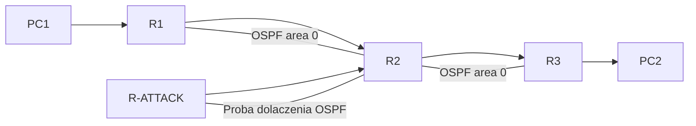
```mermaid
flowchart LR
	PC1[PC1] --> R1[R1]
	R1 --> R2[R2]
	R2 --> R3[R3]
	R3 --> PC2[PC2]
	RA[R-ATTACK] --> R2

	R1 ---|OSPF area 0| R2
	R2 ---|OSPF area 0| R3
	RA ---|Proba dolaczenia OSPF| R2
```

### 2.3. Urządzenia i role

1. **R1, R2, R3**: legalne routery tworzące domenę OSPF.
2. **R-ATTACK**: nieautoryzowany router próbujący rozgłosić fałszywy prefiks.
3. **PC1, PC2**: hosty testowe do ping/tracert.

### 2.4. Założenia testowe

1. Cały eksperyment jest wykonywany wyłącznie w laboratorium Packet Tracer.
2. Porównywane są trzy stany: przed atakiem, w trakcie ataku, po zabezpieczeniu.
3. Każdy wynik jest weryfikowany co najmniej dwiema metodami: tablica routingu + test łączności.

### 2.5. Topologia wykonana w CPT

Poniżej znajduje się finalna topologia przygotowana w Cisco Packet Tracer:

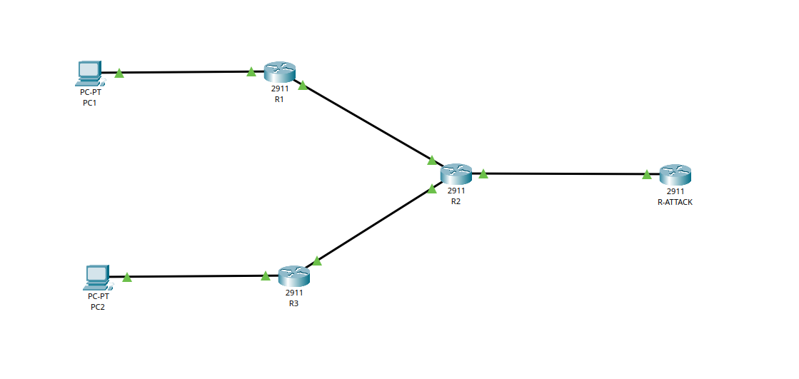

<a id="sec-3"></a>
## 3. Adresacja i role urządzeń

### 3.1. Plan adresacji

| Segment | Adres sieci | Maska | Przeznaczenie |
|---|---|---|---|
| LAN-PC1 | 192.168.1.0 | /24 | Sieć hosta PC1 |
| R1-R2 | 10.0.12.0 | /30 | Łącze tranzytowe |
| R2-R3 | 10.0.23.0 | /30 | Łącze tranzytowe |
| R2-ATTACK | 10.0.24.0 | /30 | Łącze do routera atakującego |
| LAN-PC2 | 192.168.2.0 | /24 | Sieć hosta PC2 |
| TEST-INJECT | 172.16.200.0 | /24 | Prefiks użyty w ataku |

### 3.2. Przypisanie interfejsów (Cisco IOS)

| Urządzenie | Interfejs | Adres IP | Połączenie |
|---|---|---|---|
| R1 | G0/0 | 192.168.1.1/24 | PC1 |
| R1 | G0/1 | 10.0.12.1/30 | R2 |
| R2 | G0/0 | 10.0.12.2/30 | R1 |
| R2 | G0/1 | 10.0.23.1/30 | R3 |
| R2 | G0/2 | 10.0.24.1/30 | R-ATTACK |
| R3 | G0/0 | 10.0.23.2/30 | R2 |
| R3 | G0/1 | 192.168.2.1/24 | PC2 |
| R-ATTACK | G0/0 | 10.0.24.2/30 | R2 |
| R-ATTACK | Lo0 | 172.16.200.1/24 | Prefiks wstrzykiwany |

### 3.3. Konfiguracja hostów

| Host | IP | Maska | Brama |
|---|---|---|---|
| PC1 | 192.168.1.10 | 255.255.255.0 | 192.168.1.1 |
| PC2 | 192.168.2.10 | 255.255.255.0 | 192.168.2.1 |

### 3.4. Diagram adresacji

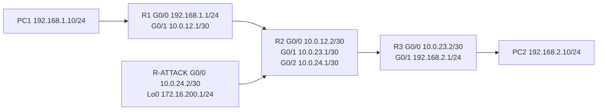
```mermaid
flowchart LR
	PC1[PC1 192.168.1.10/24] --> R1[R1 G0/0 192.168.1.1/24\nG0/1 10.0.12.1/30]
	R1 --> R2[R2 G0/0 10.0.12.2/30\nG0/1 10.0.23.1/30\nG0/2 10.0.24.1/30]
	R2 --> R3[R3 G0/0 10.0.23.2/30\nG0/1 192.168.2.1/24]
	R3 --> PC2[PC2 192.168.2.10/24]
	RA[R-ATTACK G0/0 10.0.24.2/30\nLo0 172.16.200.1/24] --> R2
```

<a id="sec-4"></a>
## 4. Scenariusz ataku: OSPF Route Injection

### 4.1. Cel ataku

Celem jest pokazanie, że bez uwierzytelniania OSPF nieautoryzowany router może dołączyć do domeny i rozgłosić prefiks `172.16.200.0/24`.

### 4.2. Stan bazowy (przed atakiem)

Na R1-R3 konfigurowany jest OSPF area 0 tylko dla legalnych interfejsów. Oczekiwany wynik:
1. R1, R2 i R3 widzą sąsiadów OSPF,
2. PC1 ping do PC2 działa,
3. na R1 i R3 nie ma trasy do 172.16.200.0/24.

Polecenia weryfikacyjne:

```bash
show ip ospf neighbor
show ip route ospf
show ip protocols
```

#### Dowody stanu bazowego

**R1 (przed atakiem):**

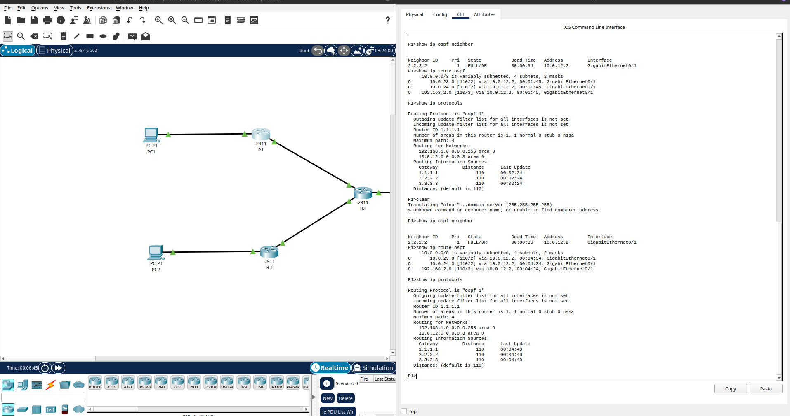

**R2 (przed atakiem):**

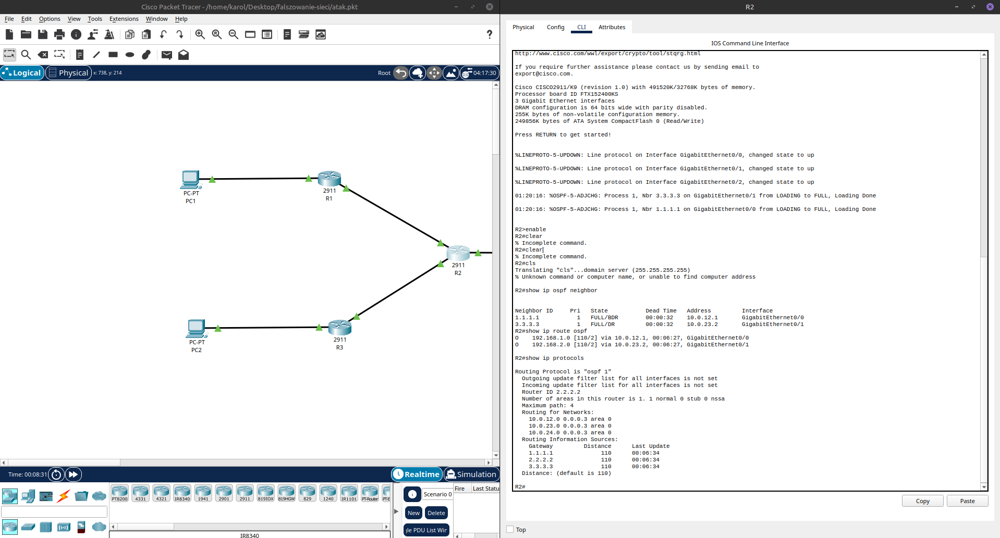

**R3 (przed atakiem):**

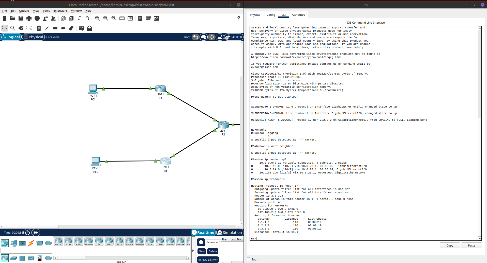

**Test ping PC1 → PC2:**

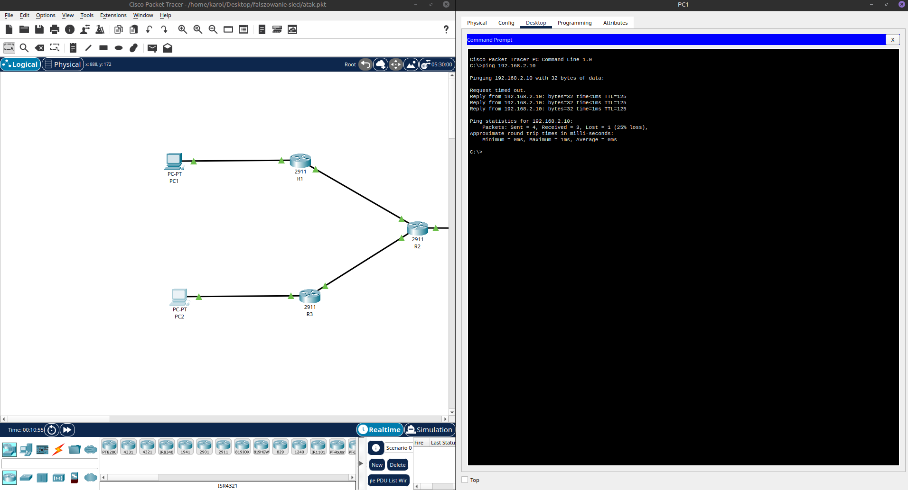

### 4.3. Realizacja ataku

Na R-ATTACK uruchamiany jest OSPF i reklamowana jest sieć `10.0.24.0/30` oraz loopback `172.16.200.0/24`.

Przykładowa konfiguracja IOS (R-ATTACK):

```bash
conf t
hostname R-ATTACK
interface g0/0
 ip address 10.0.24.2 255.255.255.252
 no shutdown
interface loopback0
 ip address 172.16.200.1 255.255.255.0
router ospf 1
 router-id 4.4.4.4
 network 10.0.24.0 0.0.0.3 area 0
 network 172.16.200.0 0.0.0.255 area 0
end
write
```

### 4.4. Oczekiwany efekt ataku

1. Na R2 pojawia się sąsiedztwo OSPF z R-ATTACK.
2. Na R1 i R3 pojawia się trasa OSPF do `172.16.200.0/24`.
3. Traceroute z legalnej części sieci pokazuje przejście przez R2 do R-ATTACK dla tego prefiksu.

#### Dowody efektu ataku

**R2 (stan podczas ataku) - sąsiedztwo OSPF:**

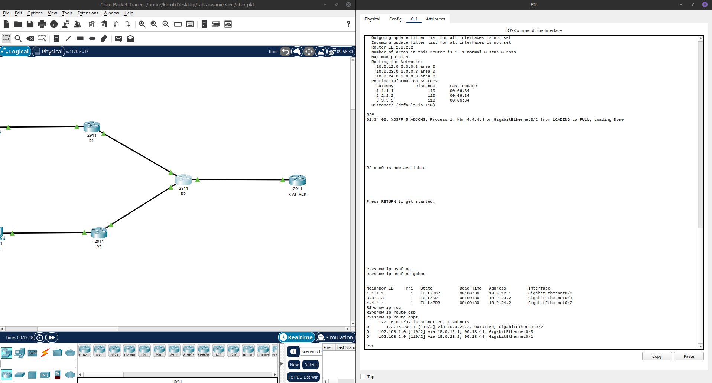

**R1 (stan podczas ataku) - tablice routingu:**

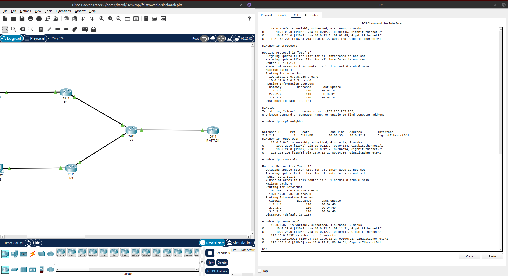

**R3 (stan podczas ataku) - tablice routingu:**

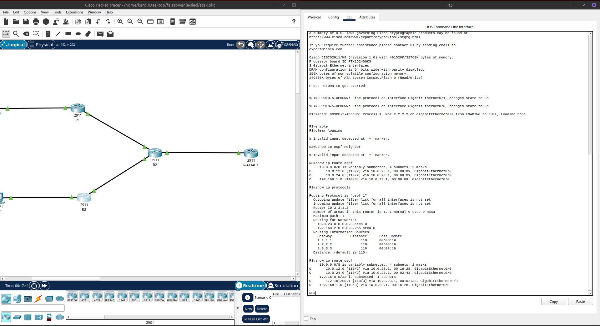

**Test tracert z PC1 do prefiksu atakującego (172.16.200.1):**

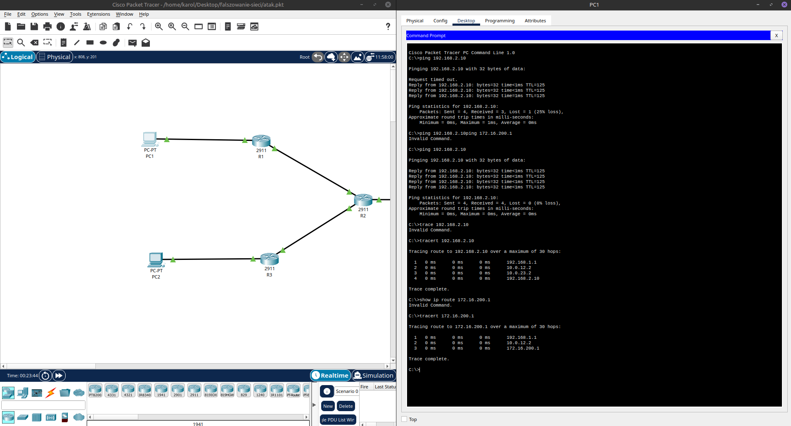

### 4.5. Kryteria sukcesu

Atak uznajemy za skuteczny, jeśli jednocześnie:
1. sąsiedztwo OSPF R2<->R-ATTACK jest w stanie Full,
2. prefiks `172.16.200.0/24` jest widoczny jako trasa OSPF na legalnych routerach,
3. ruch testowy do tego prefiksu faktycznie idzie przez R-ATTACK.

### 4.6. Gotowe konfiguracje IOS (przed zabezpieczeniem)

Poniższe konfiguracje pozwalają odtworzyć stan bazowy oraz etap ataku w Packet Tracerze.

#### R1 (legalny)

```bash
enable
conf t
hostname R1
interface g0/0
 ip address 192.168.1.1 255.255.255.0
 no shutdown
interface g0/1
 ip address 10.0.12.1 255.255.255.252
 no shutdown
router ospf 1
 router-id 1.1.1.1
 network 192.168.1.0 0.0.0.255 area 0
 network 10.0.12.0 0.0.0.3 area 0
end
write
```

#### R2 (legalny - rdzeń)

```bash
enable
conf t
hostname R2
interface g0/0
 ip address 10.0.12.2 255.255.255.252
 no shutdown
interface g0/1
 ip address 10.0.23.1 255.255.255.252
 no shutdown
interface g0/2
 ip address 10.0.24.1 255.255.255.252
 no shutdown
router ospf 1
 router-id 2.2.2.2
 network 10.0.12.0 0.0.0.3 area 0
 network 10.0.23.0 0.0.0.3 area 0
 network 10.0.24.0 0.0.0.3 area 0
end
write
```

#### R3 (legalny)

```bash
enable
conf t
hostname R3
interface g0/0
 ip address 10.0.23.2 255.255.255.252
 no shutdown
interface g0/1
 ip address 192.168.2.1 255.255.255.0
 no shutdown
router ospf 1
 router-id 3.3.3.3
 network 10.0.23.0 0.0.0.3 area 0
 network 192.168.2.0 0.0.0.255 area 0
end
write
```

#### R-ATTACK (atakujący)

```bash
enable
conf t
hostname R-ATTACK
interface g0/0
 ip address 10.0.24.2 255.255.255.252
 no shutdown
interface loopback0
 ip address 172.16.200.1 255.255.255.0
router ospf 1
 router-id 4.4.4.4
 network 10.0.24.0 0.0.0.3 area 0
 network 172.16.200.0 0.0.0.255 area 0
end
write
```

#### PC (ustawienia IP)

1. PC1: IP `192.168.1.10`, maska `255.255.255.0`, brama `192.168.1.1`.
2. PC2: IP `192.168.2.10`, maska `255.255.255.0`, brama `192.168.2.1`.

<a id="sec-5"></a>
## 5. Wdrożone zabezpieczenia OSPF

W wersji Packet Tracer zastosowano dwa podstawowe mechanizmy:
1. uwierzytelnianie OSPF MD5 na łączu R2-legalny świat,
2. ograniczenie ogłaszania OSPF na interfejsach, gdzie nie są potrzebni sąsiedzi (`passive-interface`).

### 5.1. Konfiguracja ochronna (R2 - przykład)

```bash
conf t
interface g0/0
 ip ospf message-digest-key 1 md5 OSPFsecure123
 ip ospf authentication message-digest
interface g0/1
 ip ospf message-digest-key 1 md5 OSPFsecure123
 ip ospf authentication message-digest
!
router ospf 1
 passive-interface g0/2
end
write
```

Uwaga: analogiczne parametry MD5 muszą być ustawione także po drugiej stronie legalnych łączy (na R1 i R3), aby sąsiedztwa legalne działały poprawnie.

### 5.2. Dlaczego to działa

1. Router bez poprawnego klucza MD5 nie zestawi sąsiedztwa OSPF.
2. `passive-interface` na porcie do R-ATTACK blokuje wysyłanie hello OSPF na tym porcie.
3. W efekcie R-ATTACK nie może wprowadzić swoich LSA do domeny routingu.

### 5.3. Uzupełnienie ochrony na R1 i R3 (pełny zestaw)

Aby legalne sąsiedztwa działały po włączeniu MD5, trzeba dodać klucze po obu stronach łączy.

#### R1 (interfejs do R2)

```bash
conf t
interface g0/1
 ip ospf message-digest-key 1 md5 OSPFsecure123
 ip ospf authentication message-digest
end
write
```

#### R3 (interfejs do R2)

```bash
conf t
interface g0/0
 ip ospf message-digest-key 1 md5 OSPFsecure123
 ip ospf authentication message-digest
end
write
```

<a id="sec-6"></a>
## 6. Re-test po wdrożeniu zabezpieczeń

### 6.1. Procedura re-testu

1. Pozostaw konfigurację R-ATTACK bez zmian (ta sama próba ataku).
2. Sprawdź sąsiedztwo OSPF na R2.
3. Sprawdź trasy na R1 i R3.
4. Wykonaj ping/tracert do `172.16.200.1` z legalnej części sieci.

### 6.2. Oczekiwany wynik po zabezpieczeniu

1. Brak sąsiedztwa OSPF pomiędzy R2 i R-ATTACK.
2. Brak trasy OSPF do `172.16.200.0/24` na R1 i R3.
3. Ruch do prefiksu testowego jest niedostępny (co w tym scenariuszu oznacza skuteczną ochronę).

#### Dowody po zabezpieczeniu

**R2 (po zabezpieczeniu) - sąsiedztwo OSPF i trasy:**

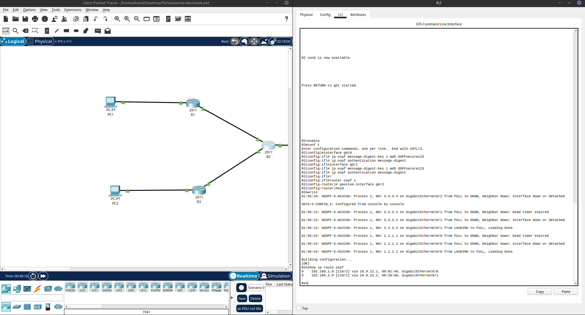

**R1 (po zabezpieczeniu) - trasy OSPF:**

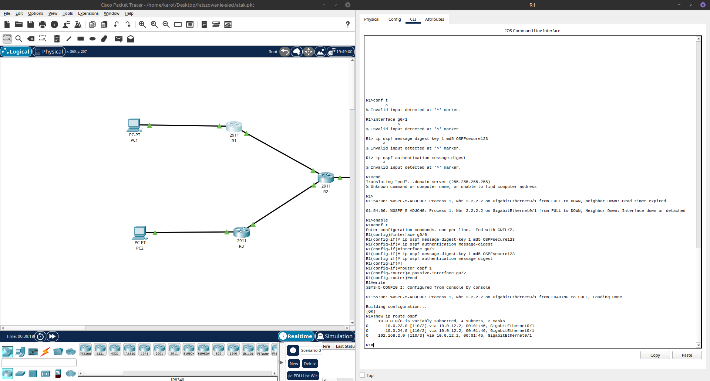

**R3 (po zabezpieczeniu) - trasy OSPF:**

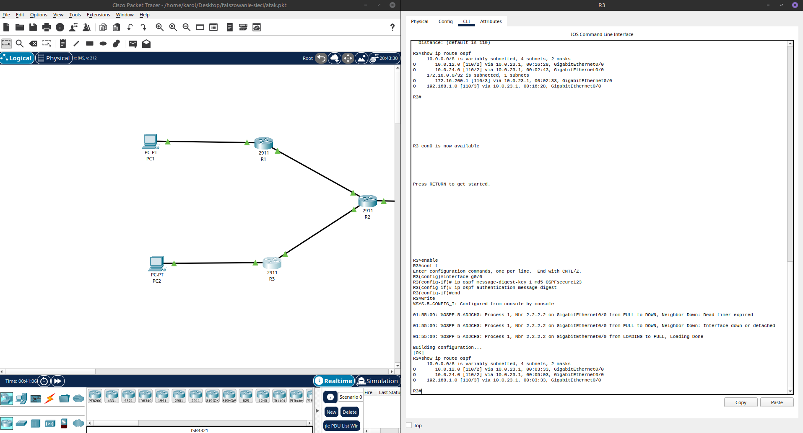

**Test ping z PC1 do 172.16.200.1 po zabezpieczeniu:**

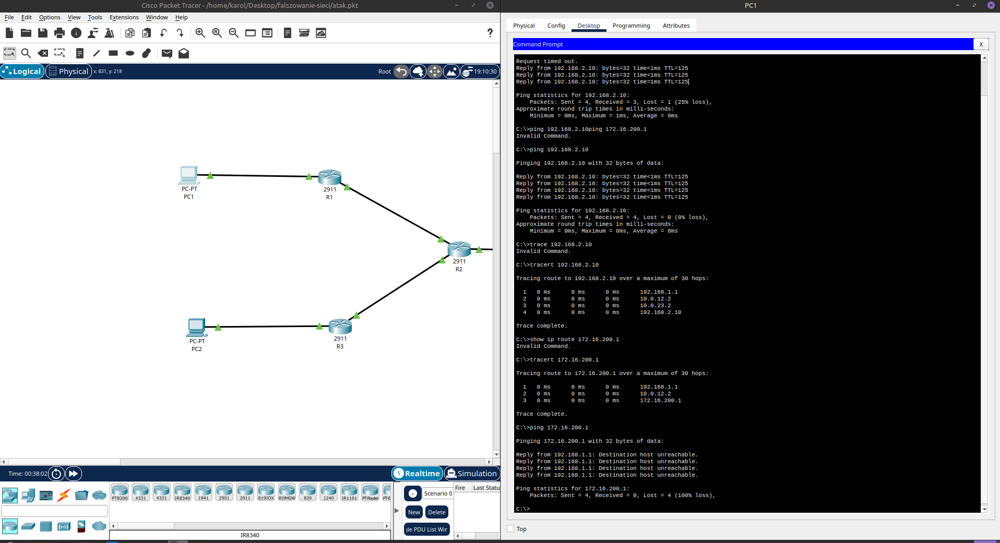

<a id="sec-7"></a>
## 7. Dowody i wyniki testów

### 7.1. Stan bazowy - adresy interfejsów (przed atakiem)

#### R1
```
Interface              IP-Address      OK? Method Status                Protocol 
GigabitEthernet0/0     192.168.1.1     YES manual up                    up 
GigabitEthernet0/1     10.0.12.1       YES manual up                    up 
GigabitEthernet0/2     unassigned      YES unset  administratively down down 
Vlan1                  unassigned      YES unset  administratively down down
```

#### R2
```
Interface              IP-Address      OK? Method Status                Protocol 
GigabitEthernet0/0     10.0.12.2       YES manual up                    up 
GigabitEthernet0/1     10.0.23.1       YES manual up                    up 
GigabitEthernet0/2     10.0.24.1       YES manual up                    up 
Vlan1                  unassigned      YES unset  administratively down down
```

#### R3
```
Interface              IP-Address      OK? Method Status                Protocol 
GigabitEthernet0/0     10.0.23.2       YES manual up                    up 
GigabitEthernet0/1     192.168.2.1     YES manual up                    up 
GigabitEthernet0/2     unassigned      YES unset  administratively down down 
Vlan1                  unassigned      YES unset  administratively down down
```

#### R-ATTACK
```
Interface              IP-Address      OK? Method Status                Protocol 
GigabitEthernet0/0     10.0.24.2       YES manual up                    up 
GigabitEthernet0/1     unassigned      YES unset  administratively down down 
GigabitEthernet0/2     unassigned      YES unset  administratively down down 
Loopback0              172.16.200.1    YES manual up                    up 
Vlan1                  unassigned      YES unset  administratively down down
```

### 7.2. Tabela porównawcza

| Test | Przed atakiem | W trakcie ataku (bez ochrony) | Po wdrożeniu ochrony |
|---|---|---|---|
| `show ip ospf neighbor` na R2 | Sąsiedzi tylko legalni | Dodatkowy sąsiad R-ATTACK | Brak sąsiada R-ATTACK |
| Trasa do `172.16.200.0/24` na R1/R3 | Brak | Obecna jako OSPF | Brak |
| Ping PC1 -> PC2 | Sukces | Sukces | Sukces |
| Trasa do prefiksu testowego | Brak | Przez R2 do R-ATTACK | Brak trasy |

### 7.3. Lista dowodów do załączenia

1. Zrzut `show ip ospf neighbor` z etapu ataku.
2. Zrzut `show ip route ospf` pokazujący `172.16.200.0/24`.
3. Zrzut tych samych komend po zabezpieczeniu.
4. Zrzut ekranu topologii w Packet Tracer.

### 7.4. Krótka checklista testów (krok po kroku)

1. Stan bazowy:
	- Na R2 wykonaj `show ip ospf neighbor` (tylko R1 i R3).
	- Na PC1 wykonaj `ping 192.168.2.10` (powinien działać).
2. Atak:
	- Włącz OSPF na R-ATTACK (konfiguracja z sekcji 4.6).
	- Na R1 lub R3 sprawdź `show ip route ospf` (powinna pojawić się `172.16.200.0/24`).
3. Ochrona:
	- Włącz MD5 na R1-R2-R3 i `passive-interface g0/2` na R2.
	- Na R2 sprawdź `show ip ospf neighbor` (R-ATTACK ma zniknąć).
4. Re-test:
	- Na R1 i R3 sprawdź, że `172.16.200.0/24` zniknęła z OSPF.
	- Z PC1 wykonaj `tracert 172.16.200.1` (brak poprawnej trasy).

<a id="sec-8"></a>
## 8. Wnioski i rekomendacje

### 8.1. Podsumowanie końcowe

Zrealizowany scenariusz potwierdził, że protokół OSPF, mimo swojej dojrzałości i powszechności, wymaga wyraźnego wydzielenia granic zaufania. W stanie bazowym sieć działała poprawnie: R1, R2 i R3 tworzyły spójne sąsiedztwo, trasy między sieciami końcowymi były poprawnie wymieniane, a komunikacja pomiędzy hostami końcowymi działała bez zakłóceń. Ten etap był istotny, ponieważ pokazał, że podatność nie wynikała z błędnej adresacji ani z awarii fizycznej, lecz z samego modelu zaufania obowiązującego w domenie routingu.

W kolejnym kroku do domeny został wprowadzony router R-ATTACK, który po zestawieniu sąsiedztwa OSPF zaczął rozgłaszać dodatkowy prefiks 172.16.200.0/24. Z punktu widzenia legalnych routerów nowa trasa wyglądała poprawnie, ponieważ została odebrana przez mechanizmy protokołu jako zwyczajna informacja routingu od sąsiada z tej samej domeny. To pokazuje najważniejszy praktyczny problem OSPF: jeśli urządzenie może wejść do obszaru bez uwierzytelnienia, to sam mechanizm wymiany LSA nie odróżnia routera zaufanego od nieautoryzowanego.

Wpływ ataku był widoczny w kilku miejscach jednocześnie. Na R2 pojawił się nowy sąsiad, a na R1 i R3 zostały zainstalowane dodatkowe trasy OSPF prowadzące do prefiksu wstrzykiwanego przez R-ATTACK. Potwierdzenie w tablicach routingu oraz w testach `tracert` było kluczowe, ponieważ sam stan sąsiedztwa nie wystarcza jeszcze do wykazania skuteczności ataku. Dopiero zbieżność informacji z sąsiedztwa, tras i testów łączności pokazała pełny obraz podatności.

Następnie wdrożono mechanizm ochronny oparty o uwierzytelnianie MD5 oraz ograniczenie udziału interfejsu do R-ATTACK przez `passive-interface`. Ten krok zmienił charakter całego środowiska: legalne sąsiedztwa nadal działały, ale nieautoryzowany router został odcięty od możliwości uczestnictwa w wymianie OSPF. Efekt po zabezpieczeniu był jednoznaczny: R-ATTACK przestał być widoczny jako sąsiad, trasa do 172.16.200.0/24 zniknęła z legalnych routerów, a testowy ping/tracert nie potwierdził już osiągalności tego prefiksu.

Z perspektywy dydaktycznej projekt pokazuje pełen cykl bezpieczeństwa sieciowego: stan poprawny, eksploatację podatności, wdrożenie środka ochronnego i ponowną walidację. Taki układ jest wartościowy, bo pozwala nie tylko opisać zagrożenie, ale też udowodnić skuteczność ochrony w identycznym środowisku testowym. W praktyce oznacza to, że ochrona OSPF nie powinna opierać się wyłącznie na założeniu, że do routerów dostaną się tylko właściwe urządzenia. Konieczne są mechanizmy techniczne, które ograniczają możliwość podłączenia się do domeny oraz wymuszają zgodność parametrów uwierzytelniania.

Najważniejszy wniosek jest więc podwójny. Po pierwsze, OSPF bez zabezpieczeń jest podatny na route injection już na poziomie zestawienia sąsiedztwa. Po drugie, właściwie wdrożone MD5 i kontrola interfejsów skutecznie blokują ten scenariusz bez rozbijania poprawnej komunikacji pomiędzy legalnymi routerami. Dzięki temu projekt nie tylko demonstruje zagrożenie, ale również pokazuje prosty i praktyczny sposób jego ograniczenia.

1. Nawet prosta domena OSPF jest podatna na route injection, jeśli nie ma uwierzytelniania i kontroli interfejsów.
2. W środowisku Packet Tracer można jednoznacznie pokazać mechanizm ataku i skutek w tablicach routingu.
3. Wdrożenie OSPF MD5 oraz poprawne użycie `passive-interface` skutecznie zablokowało atak w testowanym scenariuszu.
4. Dla sieci produkcyjnych należy dodatkowo stosować segmentację, ACL i kontrolę fizycznego/logicznego dostępu do portów routingu.

Rekomendacje praktyczne:
1. Każdy link OSPF między zaufanymi routerami zabezpieczać uwierzytelnianiem.
2. Interfejsy bez legalnych sąsiadów oznaczać jako pasywne.
3. Regularnie audytować tablice routingu i sąsiedztwa OSPF.

<a id="sec-9"></a>
## 9. Załączniki

1. Plik topologii Packet Tracer: `ospf-route-injection.pkt`.
2. Zrzuty ekranów komend diagnostycznych (przed atakiem, atak, po zabezpieczeniu).
3. Krótka checklista odtworzenia ćwiczenia:
   - uruchom topologię,
   - sprawdź stan bazowy,
   - wykonaj atak z R-ATTACK,
   - włącz zabezpieczenia,
   - powtórz test i porównaj wyniki.
